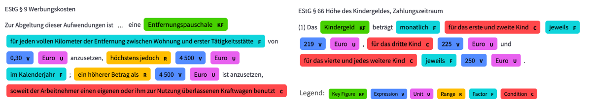
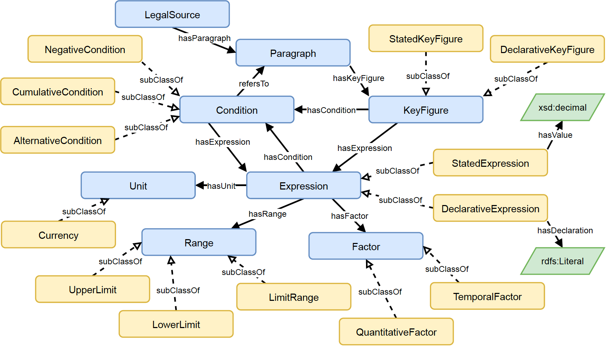
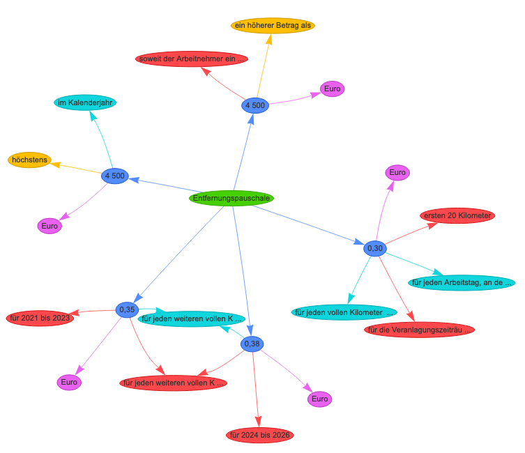
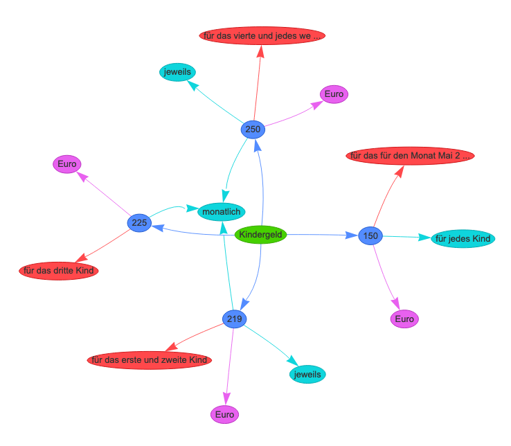
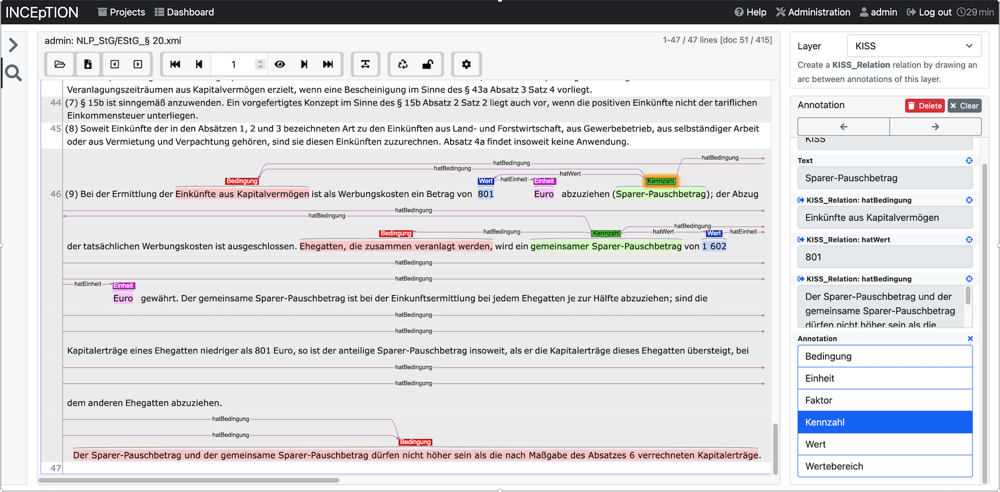
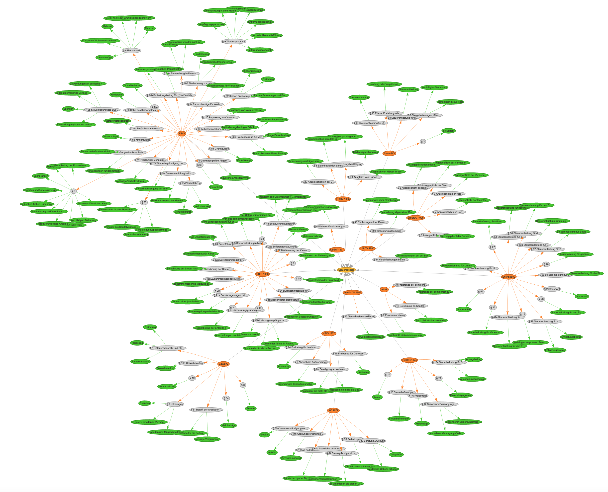
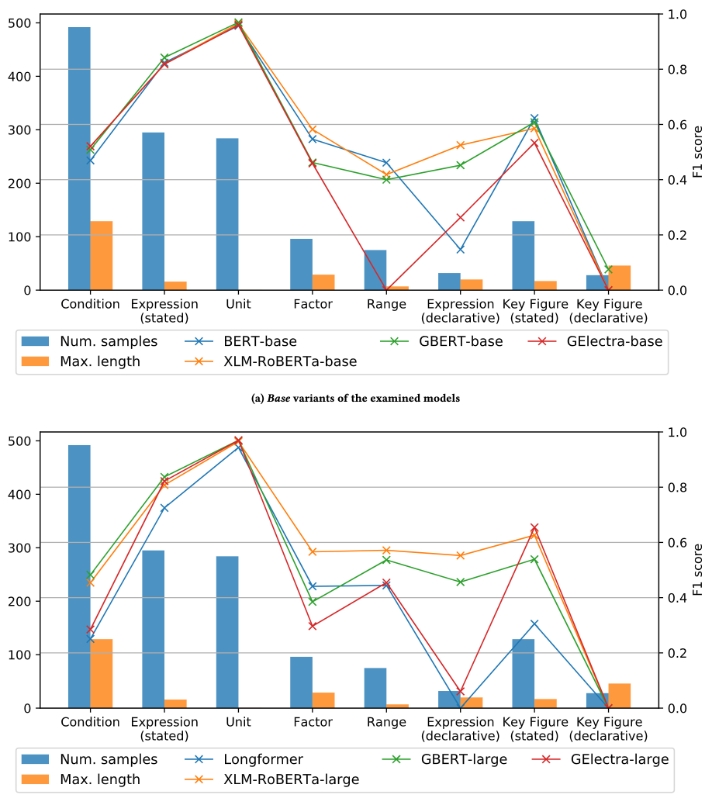
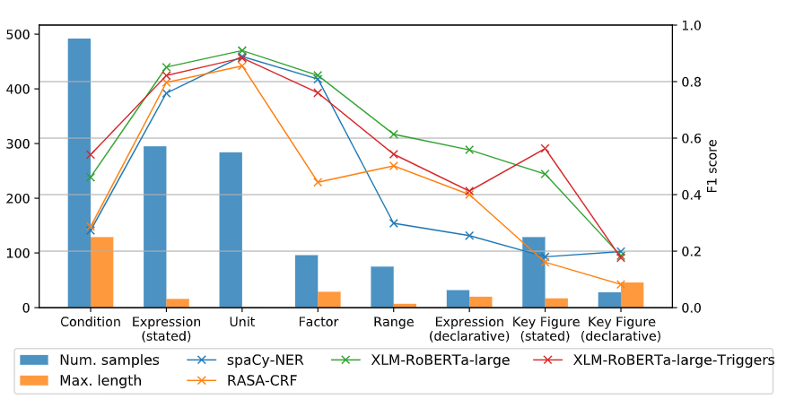
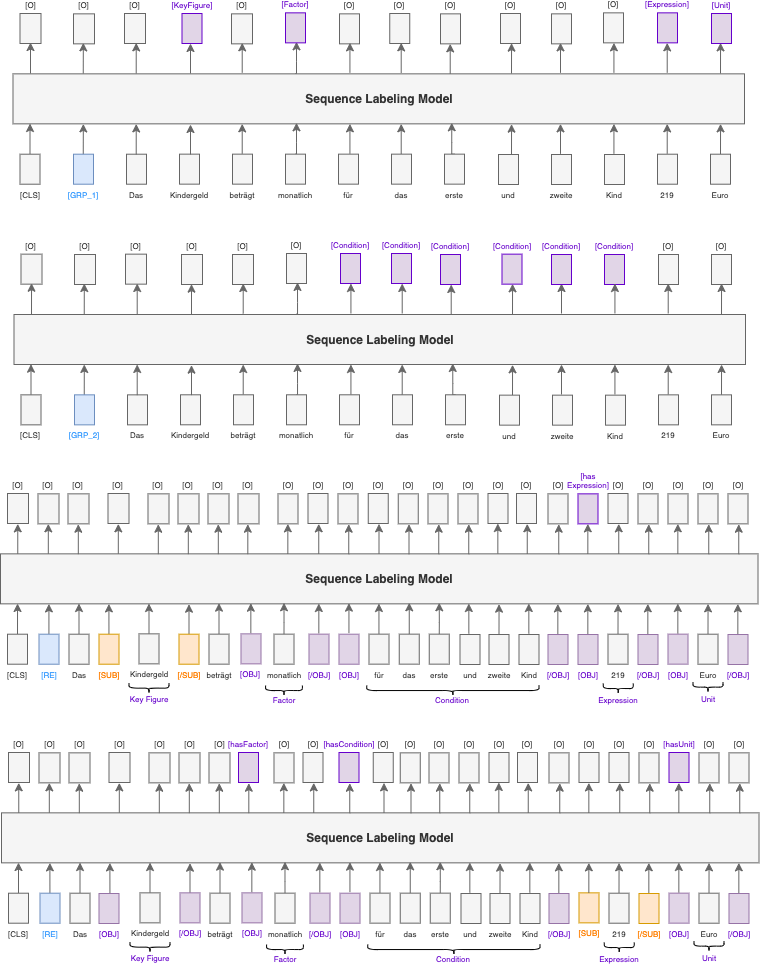
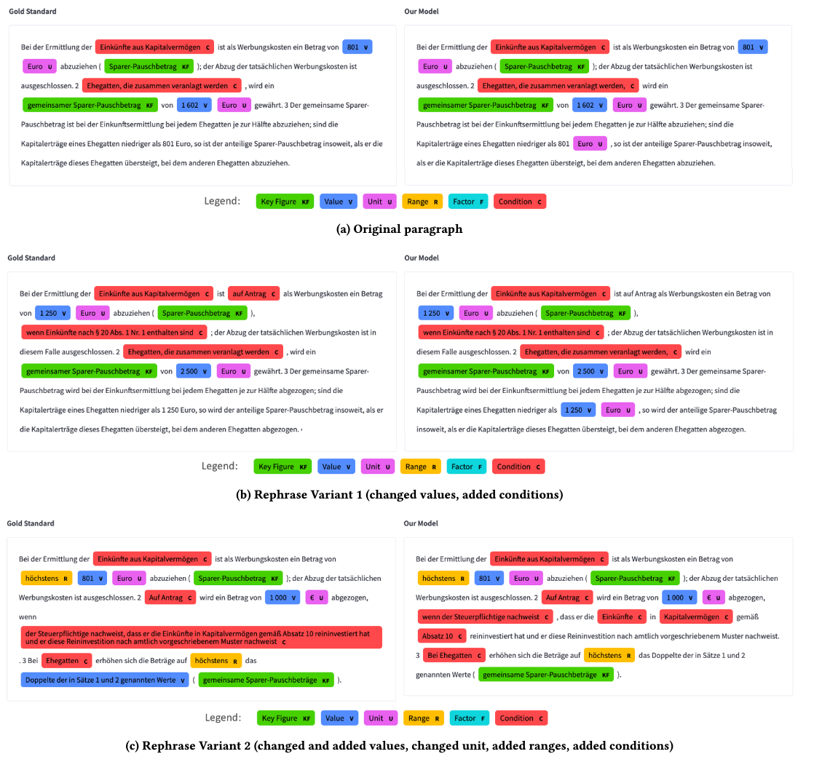

# Semantic Extraction of Key Figures and Their Properties From Tax Legal Texts using Neural Models
This repository contains the dataset and source code of the approaches and models from the paper *"Semantic Extraction of Key Figures and Their Properties From Tax Legal Texts using Neural Models"*.  
  
We provide our dataset, the best model and a demonstrator also at 🤗:
- Demonstrator: [https://huggingface.co/spaces/danielsteinigen/NLP-Legal-Texts](https://huggingface.co/spaces/danielsteinigen/NLP-Legal-Texts "Check out our Demo")
- Dataset: [https://huggingface.co/datasets/danielsteinigen/KeyFiTax](https://huggingface.co/datasets/danielsteinigen/KeyFiTax "Check out our Dataset")
- Model: [https://huggingface.co/danielsteinigen/KeyFiTax](https://huggingface.co/danielsteinigen/KeyFiTax "Check out our Model")

## Dataset
In our paper we introduced __*KeyFiTax*__, a dataset with key figures based on paragraphs of German tax acts manually annotated by tax experts.
The dataset is available under [Datasets](datasets/KeyFiTax "Check out the dataset").

<br>
Two excerpts from paragraphs annotated according to our developed annotation scheme  

The annotation of the dataset was performed according to the semantic model defined in this ontology (for more details refer to our paper):  
  
<br><br>

Relations between annotation of the two excerpts from paragraphs according to our defined ontology:
<table>
     <tr><td></td>
     <td></td></tr>
</table>
<br>

The generated dataset includes 106 annotated paragraphs from 14 different German tax acts. The [Dataset](datasets/KeyFiTax "Check out the dataset") folder contains the following files:
- `KeyFiTax_Data.json`: list of the paragraphs annotated according to the semantic model,
- `KeyFiTax_Fictitious.json`: manually modified and fictitious paragraphs for additional evaluation of the approaches,
- `KeyFiTax_Overview.json`: Overview of the extracted entities and relations overall and per tax act,
- `KeyFiTax_Model.rdf`: **Semantic Model for Key Figures and their properties in legal texts** as decribed in our paper (created with Protégé),
- `KeyFiTax_KG.rdf`: **Knowledge Graph for Tax Key Figures** populated based on the annotated paragraphs using the semantic model (can be opened with Protégé).


Following tables show the statistics of the generated dataset with the number of annotated instances per class.

| Entity Type | No. Samples |
|---|---|
| Key Figure (stated) | 129 |
| Key figure (declarative) | 28 |
| Expression (stated) | 295 |
| Expression (declarative) | 32 |
| Unit | 284 |
| Condition | 492 |
| Range | 75 |
| Factor | 96 |
 
<br>

| Relation Type | No. Samples |
|---|---|
| hasParagraph | 106 |
| hasKeyFigure | 157 |
| hasExpression | 319 |
| hasUnit | 278 |
| hasCondition | 399 |
| hasRange | 75 |
| hasFactor | 137 |
| join | 138 |
 
<br>

The list of tax acts of which paragraphs are included in the dataset can be found in the following table:

| Tax Act | German Name | English Name |
|---|---|---|
| AO | Abgabenordnung | Fiscal Code |
| AStG | Außensteuergesetz | External Tax Relations Act  |
| EStG | Einkommensteuergesetz | Income Tax Act |
| EStDV | Einkommensteuer-Durchführungsverordnung | Income Tax Implementing Regulation |
| EnergieStG | Energiesteuergesetz | Energy Tax Act |
| ErbStG | Erbschaftsteuer- und Schenkungsteuergesetz | Inheritance Tax Act |
| ErbStDV | Erbschaftsteuer-Durchführungsverordnung | Inheritance Tax Implementing Regulation |
| GewStG | Gewerbesteuergesetz | Trade Tax Act |
| GewStDV | Gewerbesteuer-Durchführungsverordnung | Trade Tax Implementing Regulation |
| KStG | Körperschaftsteuergesetz | Corporate Tax Act |
| KStDV | Körperschaftsteuer-Durchführungsverordnung | Corporate Tax Implementing Regulation |
| StromStG | Stromsteuergesetz | Electricity Tax Act |
| UStG | Umsatzsteuergesetz | Sales Tax Act |
| UStDV | Umsatzsteuer-Durchführungsverordnung | Value Added Tax Implementing Regulation |
 
<br>

Semantic categories with some sample formulations and their English translations are listed below.

| Categorie | Examples in German | English Translations |
|---|---|---|
| Key figure (stated) | "Pauschbeträge für Werbungskosten", "Entfernungspauschale" | "Lump sums for advertising expenses", "distance allowance" |
| Key figure (declarative) | "Steuerabzug von den nach Abzug der Betriebsausgaben oder Werbungskosten verbleibenden Einnahmen" | "Tax deduction from the income remaining after deduction of operating expenses or income-related expenses" |
| expression (stated) | "0.35", "2 Millionen", "30 Prozent" | "0.35", "2 millions", "30 percent"  |
| expression (declarative) | "10 Prozent der gesamten Einkünfte der ausländischen Gesellschaft" | "10 percent of the total income of the foreign company" |
| Unit |  "Euro", "EUR", "€" | "Euro", "EUR", "€"  |
| Condition |  "Einnahmen aus nichtselbständiger Arbeit" | "Income from non-employee work"  |
| Range |  "insgesamt bis zu", "von mindestens" | "in total up to", "of at least"  |
| Factor |  "pro Kilometer", "monatlich" | "per kilometer", "monthly"  |
 
<br>

The dataset was created using INCEpTION. Following is a screenshot of configured INCEpTION tool with some annotations.  
  
<br><br>


Overview of the annotated paragraphs and key figures:  
  
<br><br>

## Approaches
To automatically extract the entities and relations from our dataset we employ different approaches, described in our paper. The source code of the models is available under [models](models "Check out the models").

### Transformers
We evaluated different Transformer architectures for entity extraction, which resulted in the performance scores presented below.

| Model | F1 in % |
|---|---|
| GBERT_BASE | 53.97 |
| GBERT_LARGE | 52.59 |
| GElectra_BASE | 44.44 |
| GElectra_LARGE | 44.29 |
| Longformer | 38.88 |
| XLM-RoBERTa_BASE | 55.20 |
| XLM-RoBERTa_LARGE | 56.80 |
|---|---|
| spaCy-NER (cross-validated) | 45.78 |
| RASA-CRF (cross-validated) | 44.10 |
| XLM-RoBERTa_LARGE (cross-validated) | 60.91 |
| XLM-RoBERTa_LARGE-Triggers (cross-validated) | 58.78 |
 
<br>
A detailed evaluation of the models performance for each classes is shown in the following charts (F1 score).  
  
<br>

### Cross Validation
For comparing the different approaches described in our paper, we use k-fold cross validation. We choose k= 5 and randomly divide the complete dataset into five equal-sized subsets anf report the averaged F1 score achieved over all five training runs. The results are shown in the chart below.  
  
<br>


### Combined Model
In our paper we propose an approach for combined entity and relation extraction, introducing so-called __*task triggers*__. For relation extraction the entities are marked using __*typed entity markers*__. An excerpt from a paragraph with marked/labeled entities and relations and trigger tokens for entity and relation extraction accordant our proposed approach is shown in the following figure.  
  
<br><br>
  
The performance scores of the Trigger-Model for relation extraction on our dataset is presented below.

| Relation | F1 in % |
|---|---|
| hasCondition | 62.99 |
| hasExpression | 72.54 |
| hasUnit | 97.37 |
| hasFactor | 76.60 |
| hasRange | 85.88 |
| join | 68.66 |
|---|---|
| Macro-averaged | 77.34 |

<br>

### Hyperparameters
The Hyperparameters of the Transformer-based models employed in the experiment are documented in the [Transformers configuration file](models/transformers_model/config.py "See Hyperparameters").  
The Hyperparameters of the spaCy-NER model employed in the experiment are documented in the [spaCy configuration file](models/spacy_model/config.cfg  "See Hyperparameters").  
The Hyperparameters of the RASA-CRF model employed in the experiment are documented in the [RASA configuration file](models/rasa_model/config.yml  "See Hyperparameters").  
<br>

### Run the Scripts
The model training can be performed using the script [`run_training.py`](models/run_training.py  "See training script") and set the required parameters. The following example will train the transfomer-based Model:
```
python run_training.py -f ../datasets/KeyFiTax/KeyFiTax_Data.json -m transformers
```

The model inference can be performed using the script [`run_inference.py`](models/run_inference.py  "See inference script")  and set the required parameters. The input data need to passed by file in the format of [`inference_sample.json`](models/inference_sample.json  "See input file"). The following example will use a trained transfomer-based Model for inference:
```
python run_inference.py -f inference_sample.json -m transformers -p transformers_model/model/keyfitax
```
<br>


### Modified paragraphs
We also createtd a test dataset of manually modified paragraphs by tax experts, as described in our paper. The following figures visulaize the extractions of our best performing model on a rephrased paragraph of EStG § 20 Abs. 9.  
   
<br><br>